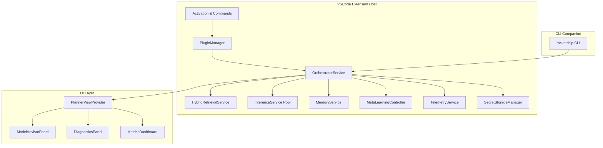
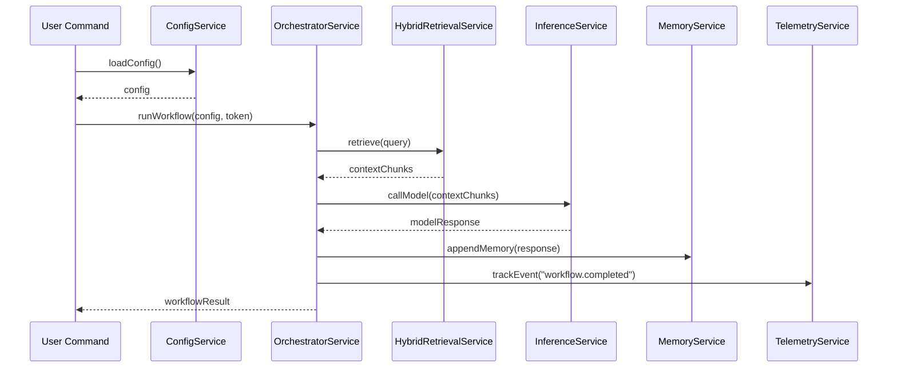

# Architectural Documentation

This document captures Rocketship’s high-level architecture, core service contracts, data flows, and guiding principles for a robust, extensible, and performant VS Code extension platform.

---

## 1. Architecture Overview



> **Figure 1.** High-level component interaction within the VS Code extension host and CLI companion citeturn0search5.

---

## 2. Architectural Decision Records (ADRs)

| ADR ID | Title                                           | Status   | Decision Date | Link                     |
|--------|-------------------------------------------------|----------|---------------|--------------------------|
| ADR-001| Define core feature vs. plugin toggles          | Accepted | 2025-05-10    | docs/adr/001-feature.md  |
| ADR-002| Choose HybridRetrievalService over multiple APIs| Accepted | 2025-05-11    | docs/adr/002-retrieval.md|
| ADR-003| Adopt semaphore-based dynamic throttling        | Proposed | 2025-05-12    | docs/adr/003-throttle.md |
| ADR-004| Separate inference into child processes         | Accepted | 2025-05-13    | docs/adr/004-inference.md|

> **ADR Best Practices:** Capture each decision with context, alternatives, rationale, and consequences to ensure traceability and consistent architectural evolution citeturn2search1.

---

## 3. Core Service & Module Contracts

### 3.1 ConfigService
- **Responsibility:** Load, validate, and expose `rocketship.yaml` settings.
- **Interface:**
  ```ts
  interface ConfigService {
    loadConfig(): Promise<Config>;
    onDidChangeConfig: Event<Config>;
  }
  ```
- **SLAs:** Validation errors surfaced within 200ms of reload.

### 3.2 PluginManager
- **Responsibility:** Discover and initialize optional feature modules.
- **Interface:**
  ```ts
  interface PluginManager {
    listPlugins(): PluginInfo[];
    activatePlugin(id: string): Promise<void>;
    deactivatePlugin(id: string): Promise<void>;
  }
  ```

### 3.3 OrchestratorService
- **Responsibility:** Coordinate multi-agent workflows (`Plan → Code → Test`).
- **Interface:**
  ```ts
  interface OrchestratorService {
    runWorkflow(workflow: WorkflowDefinition, token: CancellationToken): Promise<WorkflowResult>;
  }
  ```

### 3.4 HybridRetrievalService
- **Responsibility:** Perform vector + graph-based context retrieval.
- **Interface:**
  ```ts
  interface HybridRetrievalService {
    retrieve(query: string, options?: RetrievalOptions): Promise<ContextChunk[]>;
  }
  ```

### 3.5 InferenceService
- **Responsibility:** Manage a pool of child processes for LLM inference.
- **Interface:**
  ```ts
  interface InferenceService {
    callModel(request: ModelRequest): Promise<ModelResponse>;
    prewarmAdapter(adapterId: string): Promise<void>;
  }
  ```

### 3.6 MemoryService
- **Responsibility:** Store session and persistent memories.
- **Interface:**
  ```ts
  interface MemoryService {
    getSessionMemory(sessionId: string): MemoryRecord[];
    getPersistentMemory(key: string): MemoryRecord[];
    appendMemory(record: MemoryRecord): Promise<void>;
  }
  ```

### 3.7 MetaLearningController
- **Responsibility:** Orchestrate LoRA fine-tuning, bandits, and reflexion loops.
- **Interface:**
  ```ts
  interface MetaLearningController {
    updateAdapters(data: TrainingData): Promise<void>;
    recordFeedback(context: FeedbackContext): void;
    runReflexion(workflowResult: WorkflowResult): Promise<ReflectionReport>;
  }
  ```

### 3.8 TelemetryService
- **Responsibility:** Collect and dispatch telemetry events.
- **Interface:**
  ```ts
  interface TelemetryService {
    trackEvent(name: string, properties?: Record<string, any>): void;
    flush(): Promise<void>;
  }
  ```

### 3.9 SecretStorageManager
- **Responsibility:** Securely store and retrieve service tokens.
- **Interface:**
  ```ts
  interface SecretStorageManager {
    getSecret(key: string): Promise<string | undefined>;
    storeSecret(key: string, value: string): Promise<void>;
  }
  ```

---

## 4. Data Flow & Sequence Diagrams



> **Figure 2.** Workflow execution sequence from command invocation through retrieval, inference, memory, and telemetry citeturn0search0.

---

## 5. Non‑Functional Requirements

| Category        | Requirement                                                                                  |
|-----------------|----------------------------------------------------------------------------------------------|
| Performance     | Cold-start activation <2s; 95th percentile inference latency <3s per 512 tokens               |
| Scalability     | Support up to 4 concurrent LLM processes on 8‑core machines without host instability         |
| Reliability     | Graceful fallback to local models on cloud API failure; ≥99.5% uptime for extension services |
| Security        | Secrets never appear in plaintext logs; models checksum-verified; user consent for telemetry |
| Maintainability | ADR coverage for all major decisions; ≥80% unit test coverage; nightly schema validation    |

---

## 6. Deployment & CI Integration

- **CLI Companion (`@rocketship/cli`):** Provides headless access for CI; shares core services via `Dependency Injection` container.  
- **GitHub Actions:**  
  - `ci.yml` ➔ install, lint, unit tests  
  - `bench.yml` ➔ performance benchmarks (HumanEval, SWE-bench)  
  - `release.yml` ➔ package, tag, publish VSIX & NPM  
  - `smoke-tests.yml` ➔ install VSIX, run basic health checks  
- **Artifact Hosting:** VSIX on Visual Studio Marketplace; CLI on NPM registry.

---

## 7. Appendix

- **Related ADRs:** See `docs/adr/*.md`  
- **JSON Schema:** `docs/schema/rocketship.schema.json`  
- **Mermaid Diagrams:** Export SVGs to `docs/assets/arch/`  
- **Further Reading:**  
  - Modular Architecture Patterns citeturn0search5  
  - ADR Best Practices citeturn2search1  