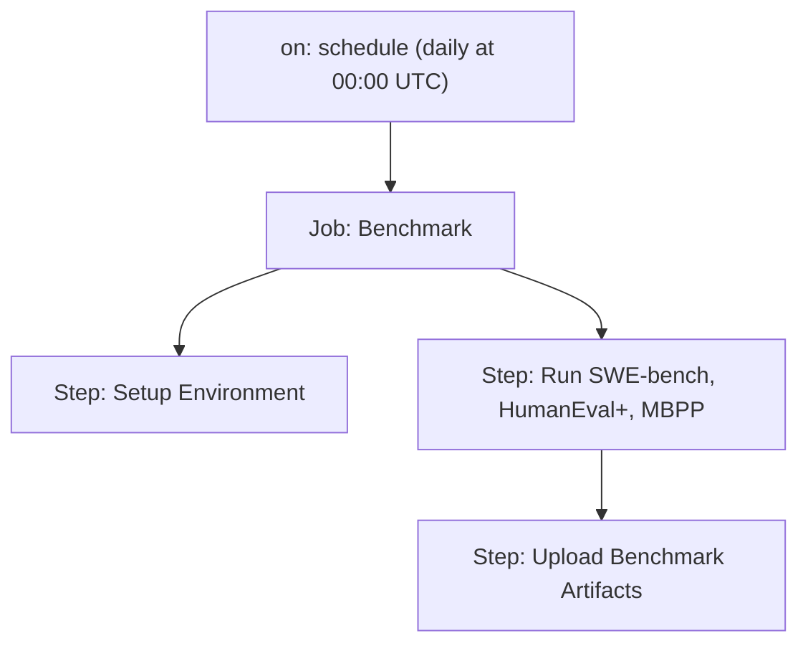
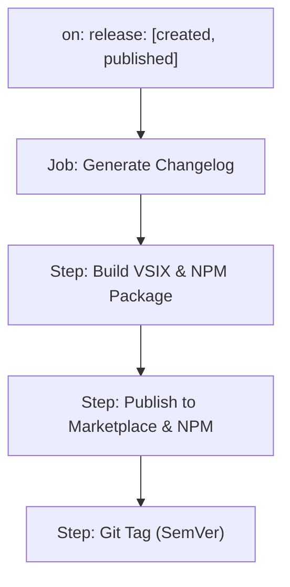
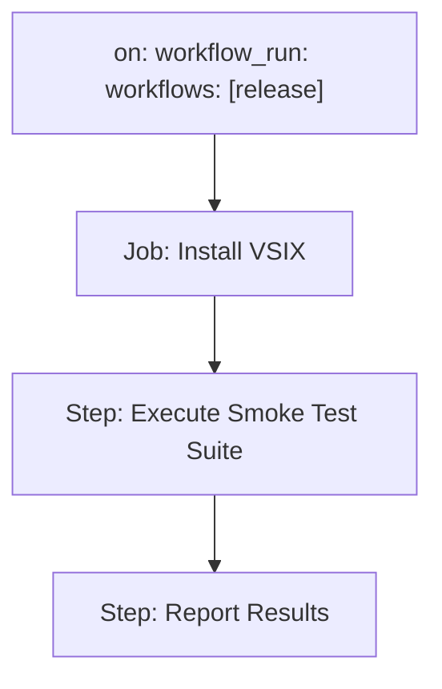

# CI/CD & Deployment Pipeline Documentation

This document outlines Rocketship’s CI/CD workflows, CLI companion runbook, and release management practices tailored for GitHub Actions and optional Jenkins integration.

---

## 1. Pipeline Diagrams

### 1.1 CI Pipeline (`ci.yml`)
```mermaid
flowchart TD
  trigger1["on: pull_request, push: [main, develop]"] --> build["Job: Build & Test"]
  build --> lint["Step: Lint"]
  build --> unit["Step: Unit Tests"]
  build --> integration["Step: Integration Tests"]
  build --> uploadArtifacts["Step: Upload Artifacts"]
  uploadArtifacts --> end
```
- **Triggers:** `pull_request` and `push` on `main`/`develop` branches citeturn0search0.
- **Environment:** `ubuntu-latest`, `macos-latest`, `windows-latest` runners citeturn0search0.
- **Artifacts:** Test reports and coverage data via `actions/upload-artifact` citeturn0search3.

### 1.2 Benchmark Pipeline (`bench.yml`)

- **Triggers:** Scheduled daily at midnight UTC via `schedule` citeturn0search5.
- **Environment:** `ubuntu-latest` with optional GPU support citeturn0search2.
- **Artifacts:** Benchmark scores and diff reports for regression tracking citeturn0search3.

### 1.3 Release Pipeline (`release.yml`)

- **Triggers:** GitHub `release` events when a new release is created citeturn0search0.
- **Artifacts:** VSIX package, NPM artifacts, and autogenerated release notes citeturn0search3.

### 1.4 Smoke Tests Pipeline (`smoke-tests.yml`)

- **Triggers:** `workflow_run` on completion of the `release` workflow citeturn0search7.
- **Tests:** Basic health checks and command invocation validation.
- **Reports:** Pass/fail status published as build artifacts.

---

## 2. CLI Companion Runbook

The `@rocketship/cli` package provides headless CI commands:

```bash
npx rocketship --ci plan      # Generate JSON plan from specs
npx rocketship --ci code      # Output code stubs to stdout or filesystem
npx rocketship --ci test      # Run tests and output results
npx rocketship export-data    # Export session & memory data
```

### 2.1 Environment Prerequisites
- **Node.js** v16+ via `actions/setup-node` citeturn0search0.
- **Xvfb** for headless webview tests on Linux; install via:
  ```bash
  sudo apt-get update && sudo apt-get install -y xvfb
  xvfb-run -a npm run smoke-tests
  ``` citeturn3search0.
- **GITHUB_TOKEN** secret for authenticating CI operations.

---

## 3. Release Management Guide

### 3.1 Semantic Versioning (SemVer)
- **Policy:** Follow [SemVer 2.0.0](https://semver.org/) (MAJOR.MINOR.PATCH) citeturn1search3.
- **Automation:** Use `semantic-release` to infer versions from commit messages and update `package.json` citeturn1search1.

### 3.2 CHANGELOG.md Conventions
- **Format:** Adhere to [Keep a Changelog](https://keepachangelog.com/) guidelines:
  ```markdown
  ## [1.2.3] - 2025-05-15
  ### Added
  - New feature X
  ### Fixed
  - Bug Y
  ``` citeturn4search0.
- **Generation:** Automate changelog creation via `auto-changelog` or GitHub Actions citeturn4search4.

### 3.3 Dependabot Grouping Rules
Include `.github/dependabot.yml` with grouping:
```yaml
version: 2
updates:
  - package-ecosystem: "npm"
    directory: "/"
    schedule:
      interval: "weekly"
    groups:
      core-deps:
        patterns: ["lodash*", "react*"]
      dev-deps:
        dependency-type: "development"
```
- **Grouping:** Combine related dependency updates into single pull requests citeturn2search0.
- **Security Updates:** Use `applies-to: "security-updates"` to group vulnerability patches citeturn2search4.