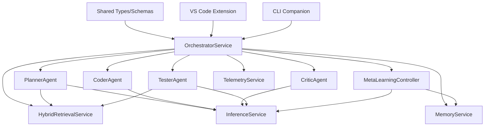
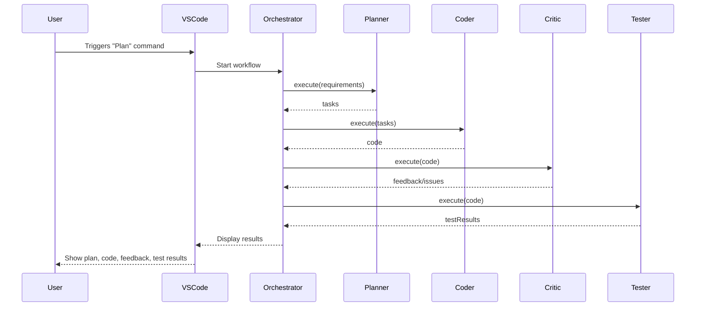
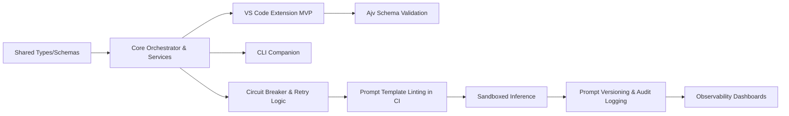

# Rocketship Project Roadmap

## Project Overview

**Project Name:** Rocketship

**Objective:**
Rocketship is a self-hostable, multi-agent automation platform for VS Code. It orchestrates specialized AI agents to automate, refactor, and enhance software projects. The platform is designed for extensibility, robust validation, metrics-driven observability, and modern dependency injection.

**Target Audience:**
- Developers and teams seeking to automate code planning, generation, review, and testing within VS Code.
- Organizations requiring extensible, auditable, and self-hosted AI-powered developer tools.

---

## Tech Stack

### Core/Backend

- **Node.js** (ESM, v18+)
- **TypeScript** (project references, strict mode)
- **LanceDB** or **pgvector/Postgres** (vector database for embeddings)
- **Ajv** (JSON schema validation)
- **Opossum** (circuit breaker patterns)
- **Testcontainers** (sandboxed inference/testing)
- **Jest** (unit/integration testing)
- **ESLint** (linting, including prompt template linting)
- **Yarn** (monorepo package management)
- **GitHub Actions** (CI/CD)

### Frontend/Extension

- **VS Code Extension API**
- **Webview Framework** (React, Vue, or Svelte—team's choice)
- **Mermaid** (for diagrams in docs and dashboards)

### Observability

- **Prometheus** (metrics backend)
- **VS Code Telemetry** (optional)
- **Custom Dashboards** (in `observability/`)

### Project Management

- **CHANGELOG.md** (release tracking)
- **rocketship.yaml** (feature toggles, config)
- **Markdown docs** (architecture, onboarding, etc.)

---

## Deliverables

| Deliverable                        | Description                                                                 | Expected Timeline      |
|-------------------------------------|-----------------------------------------------------------------------------|------------------------|
| Shared Package Types/Schemas        | Publish and verify shared TypeScript types and JSON schemas                 | Week 1                 |
| Core Orchestrator & Services        | Implement OrchestratorService, core agents, and service APIs                | Week 2-3               |
| ScaffolderAgent & DeployerAgent    | Scaffold and integrate agents for project scaffolding and deployment        | Week 3-4               |
| VS Code Extension MVP               | Plan→Code→Test UI panels, agent integration, config validation              | Week 4-5               |
| CLI Companion                       | Headless automation for plan/code/test flows                                | Week 6                 |
| Ajv Schema Validation Integration   | Enforce runtime validation of agent outputs                                 | Week 7                 |
| Circuit Breaker & Retry Logic       | Add Opossum-based circuit breakers to agent/service calls                   | Week 8                 |
| Prompt Template Linting in CI       | Enforce safe prompt templates and linting in GitHub Actions                 | Week 9                 |
| Sandboxed Inference (Testcontainers)| Isolate LLM/test execution in Docker/Testcontainers                         | Week 10-11             |
| Prompt Versioning & Audit Logging   | Tag prompt templates and maintain audit logs for governance                 | Week 12                |
| Observability Dashboards            | Telemetry, metrics, and error dashboards                                    | Week 13                |

---

## Dependency Graphs

---

## Mermaid Diagrams

### Plan→Code→Critique→Test Sequence

### Feature/Milestone Flow

---

## Progress Tracking

| Deliverable                        | Expected Completion | Actual Completion | Status      |
|-------------------------------------|---------------------|-------------------|-------------|
| Shared Package Types/Schemas        | Week 1              | Week 1            | Completed   |
| Core Orchestrator & Services        | Week 3              | Week 3            | Completed   |
| ScaffolderAgent & DeployerAgent    | Week 4              | -                 | Pending     |
| VS Code Extension MVP               | Week 5              | Week 5            | Completed   |
| CLI Companion                       | Week 6              | Week 6            | Completed   |
| Ajv Schema Validation Integration   | Week 7              | -                 | In Progress |
| Circuit Breaker & Retry Logic       | Week 8              | -                 | Pending     |
| Prompt Template Linting in CI       | Week 9              | -                 | Pending     |
| Sandboxed Inference (Testcontainers)| Week 11             | -                 | Pending     |
| Prompt Versioning & Audit Logging   | Week 12             | -                 | Pending     |
| Observability Dashboards            | Week 13             | -                 | Pending     |

---

# Notes

- The tech stack is modular and extensible, supporting both ESM and robust type safety.
- Dependency graphs and Mermaid diagrams should be updated as the architecture evolves.
- Progress tracking can be integrated with tools like GitHub Projects, Jira, or Trello for more granular task management.
- Timelines are estimates and may be adjusted based on feedback, team velocity, or changing requirements.

---

This roadmap provides a clear, actionable plan for Rocketship's technical delivery, with visualizations and tracking to ensure transparency and alignment across the team.

# Rocketship Project Roadmap

## Summary
This roadmap is optimized for an LLM-driven multi-agent development workflow, breaking delivery into four phases—Foundation, Core Capability, Resilience & Governance, and Ecosystem & Observability. Each milestone is atomic, LLM-friendly, and includes explicit tasks, dependencies, commands, and validation steps to ensure robust, auditable progress.

---

## Phase I: Foundation (Weeks 1–3)
### Milestone 1.1 Monorepo & Project References
- **Objective:** Enable TypeScript project references across packages (`shared`, `core`, `extension`, `cli`) with `"composite": true`, `"declaration": true`, `"module": "NodeNext"`, correct `rootDir`/`outDir`.
- **Tasks:**
  1. Validate and patch each `tsconfig.json` for required flags.
  2. Run `tsc --build --verbose` and assert zero build errors.
  3. Generate a visual dependency graph (e.g., via `tsc --build --dry --listFiles`).
- **Validation:** CI job "Monorepo Build" passes cleanly.

### Milestone 1.2 Shared Types & Schemas Publication
- **Objective:** Publish `shared/dist` artifacts and validate JSON schemas.
- **Tasks:**
  1. Run `node packages/core/scripts/gen-mocks.ts` to produce fixture mocks.
  2. Validate schemas with `ajv validate -s shared/schemas/*.json -d packages/core/__fixtures__/*.json`.
- **Validation:** CI job "Generate & Validate Shared Mocks" succeeds.

### Milestone 1.3 Basic Plan→Code→Test Workflow
- **Objective:** Smoke-test end-to-end Plan→Code→Test via CLI.
- **Tasks:**
  1. Implement `rocketship plan -i specs.md` CLI command.
  2. Populate minimal `.tpl` prompts in `extension/src/prompts/`.
  3. Execute `yarn cli plan -i specs.md` and verify structured JSON output.
- **Validation:** CLI returns `{"plan":…, "code":…, "testResults":…}`.

---

## Phase II: Core Capability (Weeks 4–7)
### Milestone 2.1 Hybrid Retrieval & Embedding
- **Objective:** Implement incremental PKG graph updates and vector embeddings with adaptive windowing.
- **Tasks:**
  1. File-watch ingestion using `chokidar`.
  2. Embed new chunks with LanceDB; prune >90% cosine similarity duplicates.
- **Validation:** Unit tests confirm top-K retrieval under 1s latency.

### Milestone 2.2 Memory & Meta-Learning Controller
- **Objective:** Persist memory and bound reflexion loops.
- **Tasks:**
  1. Append `MemoryRecord` to JSONL store.
  2. Implement `runReflexion` with max 2 iterations and quality delta threshold.
- **Validation:** Logs show single reflexion unless quality delta >=5%.

### Milestone 2.3 Telemetry & Observability Setup
- **Objective:** Instrument agents/services with Prometheus metrics.
- **Tasks:**
  1. Wrap agent calls in `createCircuitBreaker`.
  2. Expose `/metrics` endpoint.
- **Validation:** Grafana dashboards in `observability/dashboards/`.

---

## Phase III: Resilience & Governance (Weeks 8–10)
### Milestone 3.1 Circuit Breakers & Dynamic Throttling
- **Objective:** Add Opossum.js breakers and real-time semaphore tuning.
- **Tasks:**
  1. Implement `CircuitBreakerFactory` with fallback.
  2. Sample host CPU/RAM every 5s; adjust permits ±1 to maintain ≤70% usage.
- **Validation:** Simulated resource load tests pass without saturation.

### Milestone 3.2 JSON-Schema Validation of Agent Outputs
- **Objective:** Validate each agent's response with Ajv.
- **Tasks:**
  1. Define JSON schemas in `packages/core/schemas/agent-*.json`.
  2. Fail workflow on schema validation errors.
- **Validation:** CI step "Validate Agent Output Schemas" green.

### Milestone 3.3 Prompt Template Linting & Versioning
- **Objective:** Enforce safe Handlebars templates and audit prompt versions.
- **Tasks:**
  1. Run `handlebars-lint` in CI on `.tpl` files.
  2. Tag templates with `{{!--@promptVersion:{{gitSHA}}--}}` header.
- **Validation:** CI blocks PRs with lint errors; telemetry logs promptVersion.

---

## Phase IV: Ecosystem & Observability (Weeks 11–13+)
### Milestone 4.1 Sandboxed Inference & Testing
- **Objective:** Isolate code execution in Docker/Testcontainers.
- **Tasks:**
  1. Spin up ephemeral container `rocketship/inference-sandbox:latest`.
  2. Bind-mount only `/workspace`; enforce read-only host mounts elsewhere.
- **Validation:** CI job "Sandboxed Tests" passes; artifacts archived.

### Milestone 4.2 CLI & Extension Parity
- **Objective:** Centralize core logic in `@rocketship/core` for both CLI and extension.
- **Tasks:**
  1. Publish `@rocketship/core` locally.
  2. Update imports in `cli/src` and `extension/src` to use `@rocketship/core`.
- **Validation:** Single CI job "Smoke Test CLI & Extension" confirms feature parity.

### Milestone 4.3 CI/CD & Release Automation
- **Objective:** Automate Dependabot batching, SemVer, and release drafts.
- **Tasks:**
  1. Configure `dependabot.yml` grouping by ecosystem.
  2. Add `.github/workflows/release.yml` to tag and publish.
- **Validation:** Merged PR triggers release draft with updated CHANGELOG.

### Milestone 4.4 Performance & Regression Monitoring
- **Objective:** Set up SLA-driven alerts in Prometheus Alertmanager.
- **Tasks:**
  1. Define 95th-percentile plan→test >2s; error rate >5% sustained for 5min.
  2. Implement `/status` healthcheck endpoint.
- **Validation:** Alerts firing in staging on threshold breach.

---

## Progress Tracking Table
| ID | Milestone                                    | Status      | CI Job                          |
|----|----------------------------------------------|-------------|---------------------------------|
|1.1 | Monorepo & Project References                | Completed   | monorepo-build                  |
|1.2 | Shared Types & Schemas Publication           | Completed   | shared-schema-validate          |
|1.3 | Basic Plan→Code→Test Workflow                | Completed   | cli-smoke-test                  |
|2.1 | Hybrid Retrieval & Embedding                 | In Progress | retrieval-unit-tests            |
|2.2 | Memory & Meta-Learning Controller            | Pending     | memory-metaloop-tests           |
|2.3 | Telemetry & Observability Setup              | Pending     | telemetry-metrics-tests         |
|3.1 | Circuit Breakers & Dynamic Throttling        | Pending     | resilience-load-test            |
|3.2 | JSON-Schema Validation of Agent Outputs      | Pending     | schema-output-validation        |
|3.3 | Prompt Template Linting & Versioning         | Pending     | prompt-lint-ci                  |
|4.1 | Sandboxed Inference & Testing                | Pending     | sandboxed-test                  |
|4.2 | CLI & Extension Parity                       | Pending     | smoke-test-cli-extension        |
|4.3 | CI/CD & Release Automation                   | Pending     | release-automation              |
|4.4 | Performance & Regression Monitoring          | Pending     | performance-alert-tests         |

---

> **Note for LLM Agents:**
> - Execute each task as an isolated step using explicit CLI commands.
> - After each sub-task, validate success and log outputs.
> - Use the project's `rocketship.yaml` for feature toggles and environment-specific overrides.
> - Maintain a changelog entry for each milestone using `standard-version` or similar.
> - Commit small, focused PRs that update code, config, docs, and CI in lockstep.

This version is designed for seamless LLM-driven execution, ensuring clarity, auditability, and adaptability as Rocketship evolves.