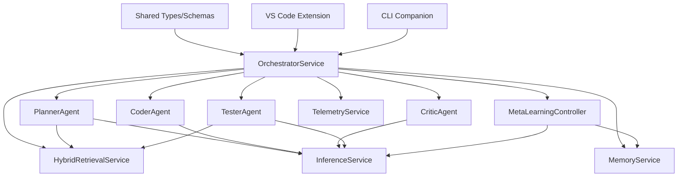
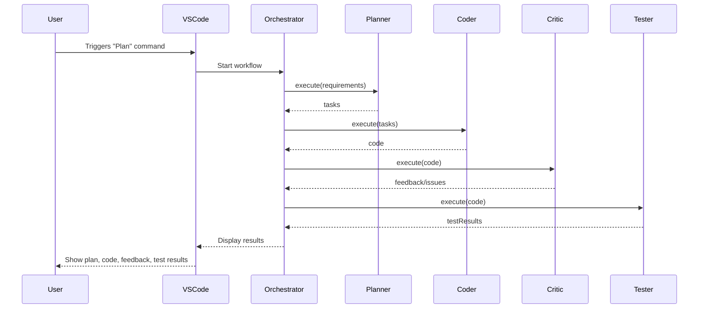
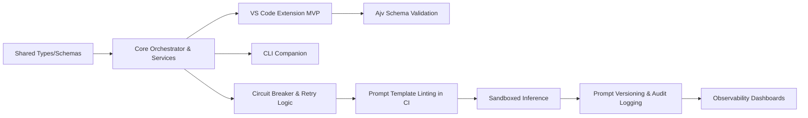

# Rocketship Project Roadmap

## Project Overview

**Project Name:** Rocketship

**Objective:**
Rocketship is a self-hostable, multi-agent automation platform for VS Code. It orchestrates specialized AI agents to automate, refactor, and enhance software projects. The platform is designed for extensibility, robust validation, metrics-driven observability, and modern dependency injection.

**Target Audience:**
- Developers and teams seeking to automate code planning, generation, review, and testing within VS Code.
- Organizations requiring extensible, auditable, and self-hosted AI-powered developer tools.

---

## Tech Stack

### Core/Backend

- **Node.js** (ESM, v18+)
- **TypeScript** (project references, strict mode)
- **LanceDB** or **pgvector/Postgres** (vector database for embeddings)
- **Ajv** (JSON schema validation)
- **Opossum** (circuit breaker patterns)
- **Testcontainers** (sandboxed inference/testing)
- **Jest** (unit/integration testing)
- **ESLint** (linting, including prompt template linting)
- **Yarn** (monorepo package management)
- **GitHub Actions** (CI/CD)

### Frontend/Extension

- **VS Code Extension API**
- **Webview Framework** (React, Vue, or Svelte—team's choice)
- **Mermaid** (for diagrams in docs and dashboards)

### Observability

- **Prometheus** (metrics backend)
- **VS Code Telemetry** (optional)
- **Custom Dashboards** (in `observability/`)

### Project Management

- **CHANGELOG.md** (release tracking)
- **rocketship.yaml** (feature toggles, config)
- **Markdown docs** (architecture, onboarding, etc.)

---

## Deliverables

| Deliverable                        | Description                                                                 | Expected Timeline      |
|-------------------------------------|-----------------------------------------------------------------------------|------------------------|
| Shared Package Types/Schemas        | Publish and verify shared TypeScript types and JSON schemas                 | Week 1                 |
| Core Orchestrator & Services        | Implement OrchestratorService, core agents, and service APIs                | Week 2-3               |
| VS Code Extension MVP               | Plan→Code→Test UI panels, agent integration, config validation              | Week 4-5               |
| CLI Companion                       | Headless automation for plan/code/test flows                                | Week 6                 |
| Ajv Schema Validation Integration   | Enforce runtime validation of agent outputs                                 | Week 7                 |
| Circuit Breaker & Retry Logic       | Add Opossum-based circuit breakers to agent/service calls                   | Week 8                 |
| Prompt Template Linting in CI       | Enforce safe prompt templates and linting in GitHub Actions                 | Week 9                 |
| Sandboxed Inference (Testcontainers)| Isolate LLM/test execution in Docker/Testcontainers                         | Week 10-11             |
| Prompt Versioning & Audit Logging   | Tag prompt templates and maintain audit logs for governance                 | Week 12                |
| Observability Dashboards            | Telemetry, metrics, and error dashboards                                    | Week 13                |

---

## Dependency Graphs

---

## Mermaid Diagrams

### Plan→Code→Critique→Test Sequence

### Feature/Milestone Flow

---

## Progress Tracking

| Deliverable                        | Expected Completion | Actual Completion | Status      |
|-------------------------------------|---------------------|-------------------|-------------|
| Shared Package Types/Schemas        | Week 1              | Week 1            | Completed   |
| Core Orchestrator & Services        | Week 3              | Week 3            | Completed   |
| VS Code Extension MVP               | Week 5              | Week 5            | Completed   |
| CLI Companion                       | Week 6              | Week 6            | Completed   |
| Ajv Schema Validation Integration   | Week 7              | -                 | In Progress |
| Circuit Breaker & Retry Logic       | Week 8              | -                 | Pending     |
| Prompt Template Linting in CI       | Week 9              | -                 | Pending     |
| Sandboxed Inference (Testcontainers)| Week 11             | -                 | Pending     |
| Prompt Versioning & Audit Logging   | Week 12             | -                 | Pending     |
| Observability Dashboards            | Week 13             | -                 | Pending     |

---

# Notes

- The tech stack is modular and extensible, supporting both ESM and robust type safety.
- Dependency graphs and Mermaid diagrams should be updated as the architecture evolves.
- Progress tracking can be integrated with tools like GitHub Projects, Jira, or Trello for more granular task management.
- Timelines are estimates and may be adjusted based on feedback, team velocity, or changing requirements.

---

This roadmap provides a clear, actionable plan for Rocketship's technical delivery, with visualizations and tracking to ensure transparency and alignment across the team.
