# Agents & API

> **Terminology Note:** For definitions of agents, services, and plugins, see the [Rocketship Glossary](glossary.md).

> **Note:** This file is the canonical, comprehensive reference for all Rocketship agent types. Every agent is fully specified here and must never be omitted or removed.

---


*Figure: The Rocketship agent ecosystem and orchestration, showing the relationships and flows between Orchestrator, PlannerAgent, CoderAgent, CriticAgent, TesterAgent, ScaffolderAgent, DeployerAgent, DebuggerAgent, MonitorAgent, DocsAgent, ReflexionAgent, and Plugin/Extension points. All diagrams are accessible and follow Rocketship's visual standards.*

```mermaid
flowchart TD
  Orchestrator((Orchestrator))
  Planner[PlannerAgent]
  Coder[CoderAgent]
  Critic[CriticAgent]
  Tester[TesterAgent]
  Scaffolder[ScaffolderAgent]
  Deployer[DeployerAgent]
  Debugger[DebuggerAgent]
  Monitor[MonitorAgent]
  Docs[DocsAgent]
  Reflexion[ReflexionAgent]
  PluginExt[Plugin/Extension]

  Orchestrator --> Planner
  Orchestrator --> Coder
  Orchestrator --> Critic
  Orchestrator --> Tester
  Planner --> Coder
  Planner --> Scaffolder
  Coder --> Critic
  Coder --> Tester
  Coder --> Deployer
  Coder --> Debugger
  Coder --> Docs
  Critic --> Coder
  Critic --> Reflexion
  Critic --> Tester
  Tester --> Orchestrator
  Scaffolder --> Coder
  Deployer --> Monitor
  Debugger --> Coder
  Monitor --> Orchestrator
  Docs --> Coder
  Reflexion -.-> Orchestrator
  PluginExt -.-> Orchestrator
  PluginExt -.-> Coder

  classDef core fill:#18181f,stroke:#00fff7,stroke-width:2;
  classDef review fill:#18181f,stroke:#ff00ea,stroke-width:2;
  class Orchestrator,Planner,Coder,Tester,Deployer,Monitor,Docs,Reflexion core;
  class Critic,Scaffolder,Debugger,PluginExt review;
```


*Figure: Mermaid diagram of the Rocketship agent ecosystem and orchestration. Alt: Orchestrator at the center, with flows to all agents and extension points, matching the SVG structure.*

---

## Agent Summary Table

| Agent Name        | Purpose/Role                                              | Key Interactions                |
|-------------------|----------------------------------------------------------|---------------------------------|
| PlannerAgent      | Decompose requirements into actionable plans/workflows    | Orchestrator, Coder, Tester     |
| CoderAgent        | Generate/refactor code from plans or prompts             | Planner, Critic, Tester         |
| CriticAgent       | Review code, enforce standards, suggest improvements     | Coder, Tester, Reflexion        |
| TesterAgent       | Generate/run/analyze tests, SAST                         | Coder, Critic, Orchestrator     |
| ScaffolderAgent   | Bootstrap new projects/modules/features                  | Planner, Coder                  |
| DeployerAgent     | Automate deployment/environment setup                    | Orchestrator, Monitor           |
| DebuggerAgent     | Diagnose/fix runtime/build errors                        | Orchestrator, Coder, Tester     |
| MonitorAgent      | Observe system health, performance, workflow progress    | Orchestrator, Telemetry         |
| DocsAgent         | Fetch/inject live API docs/examples for codegen grounding| Coder, Planner                  |
| ReflexionAgent    | Meta-cognitive self-review, learning loops               | Critic, Orchestrator, Bandit    |

---

## 1. PlannerAgent

**Purpose:** Decomposes requirements into actionable plans and workflows.

**API/Interface:**
```ts
interface PlannerAgentParams {
  requirementText: string;
  contextChunks?: ContextChunk[];
  sessionId: string;
}
interface PlannerAgentResponse {
  tasks: Array<{
    id: string;
    description: string;
    priority: 'low' | 'medium' | 'high';
  }>;
  metadata?: Record<string, any>;
}
interface PlannerAgent {
  execute(params: PlannerAgentParams, token: CancellationToken): Promise<PlannerAgentResponse>;
}
```
**Inputs:** `requirementText`, optional `contextChunks`, `sessionId`

**Outputs:** List of tasks (id, description, priority), optional metadata

**Interactions:**
- Receives requirements from OrchestratorService
- Passes plans to CoderAgent and TesterAgent
- May use DocsAgent for context

**Example Workflow:**
1. User submits requirement
2. PlannerAgent generates plan
3. Orchestrator sequences plan steps to Coder/Tester

**Config:** `agents.planner` section in config

**Security:** Input validation, prompt sanitization

**Extensibility:** Can be replaced/extended via plugin

---

## 2. CoderAgent

**Purpose:** Generates or modifies code based on plans or prompts.

**API/Interface:**
```ts
interface CoderAgentParams {
  taskId: string;
  codeContext: string;
  language: string;
  contextChunks?: ContextChunk[];
  sessionId: string;
}
interface CoderAgentResponse {
  code: string;
  diff?: string;
  metadata?: Record<string, any>;
}
interface CoderAgent {
  execute(params: CoderAgentParams, token: CancellationToken): Promise<CoderAgentResponse>;
}
```
**Inputs:** `taskId`, `codeContext`, `language`, optional `contextChunks`, `sessionId`

**Outputs:** `code`, optional `diff`, metadata

**Interactions:**
- Receives plan steps from PlannerAgent
- Passes code to CriticAgent and TesterAgent
- May use DocsAgent for API examples

**Example Workflow:**
1. Receives plan step
2. Generates code
3. Passes to CriticAgent for review

**Config:** `agents.coder` section in config

**Security:** Input/output validation, code provenance checks

**Extensibility:** Pluggable prompt templates, model selection

---

## 3. CriticAgent

**Purpose:** Reviews code, enforces standards, suggests improvements (Reflexion-style self-checks).

**API/Interface:**
```ts
interface CriticAgentParams {
  code: string;
  tests?: string[];
  sessionId: string;
}
interface CriticAgentResponse {
  feedback: string;
  issues: Array<{
    line: number;
    message: string;
    severity: 'info' | 'warning' | 'error';
  }>;
}
interface CriticAgent {
  execute(params: CriticAgentParams, token: CancellationToken): Promise<CriticAgentResponse>;
}
```
**Inputs:** `code`, optional `tests`, `sessionId`

**Outputs:** `feedback`, list of issues

**Interactions:**
- Receives code from CoderAgent
- Passes feedback to CoderAgent (for fixes) and Orchestrator
- May trigger ReflexionAgent for meta-review

**Example Workflow:**
1. Receives code
2. Reviews and annotates issues
3. Suggests fixes or triggers Reflexion

**Config:** `agents.critic` section in config

**Security:** SAST integration, prompt injection defense

**Extensibility:** Custom rules, plugin-based checks

---

## 4. TesterAgent

**Purpose:** Generates, runs, and analyzes tests (with integrated SAST).

**API/Interface:**
```ts
interface TesterAgentParams {
  code: string;
  testFramework: 'jest' | 'mocha' | 'pytest';
  sessionId: string;
}
interface TesterAgentResponse {
  testResults: Array<{
    testName: string;
    passed: boolean;
    error?: string;
  }>;
  coverage?: Record<string, number>;
}
interface TesterAgent {
  execute(params: TesterAgentParams, token: CancellationToken): Promise<TesterAgentResponse>;
}
```
**Inputs:** `code`, `testFramework`, `sessionId`

**Outputs:** `testResults`, optional `coverage`

**Interactions:**
- Receives code from CoderAgent
- Passes results to Orchestrator and CriticAgent
- May use SAST tools for security

**Example Workflow:**
1. Receives code
2. Generates and runs tests
3. Reports results and coverage

**Config:** `agents.tester` section in config

**Security:** SAST, test sandboxing

**Extensibility:** Support for new frameworks, plugin hooks

---

## 5. ScaffolderAgent

**Purpose:** Bootstraps new projects, modules, or features.

**API/Interface:**
```ts
interface ScaffolderAgentParams {
  template: string;
  parameters: Record<string, any>;
  sessionId: string;
}
interface ScaffolderAgentResponse {
  files: Array<{ path: string; content: string }>;
  metadata?: Record<string, any>;
}
interface ScaffolderAgent {
  execute(params: ScaffolderAgentParams, token: CancellationToken): Promise<ScaffolderAgentResponse>;
}
```
**Inputs:** `template`, `parameters`, `sessionId`

**Outputs:** List of files (path, content), optional metadata

**Interactions:**
- Receives requests from Orchestrator or user
- Passes generated files to CoderAgent or directly to workspace

**Example Workflow:**
1. User requests new feature
2. ScaffolderAgent generates boilerplate
3. Passes to CoderAgent for refinement

**Config:** `agents.scaffolder` section in config

**Security:** Template validation, file system sandboxing

**Extensibility:** Custom templates, plugin support

---

## 6. DeployerAgent

**Purpose:** Handles deployment automation and environment setup.

**API/Interface:**
```ts
interface DeployerAgentParams {
  environment: string;
  config: Record<string, any>;
  sessionId: string;
}
interface DeployerAgentResponse {
  status: 'success' | 'failure';
  logs: string[];
  metadata?: Record<string, any>;
}
interface DeployerAgent {
  execute(params: DeployerAgentParams, token: CancellationToken): Promise<DeployerAgentResponse>;
}
```
**Inputs:** `environment`, `config`, `sessionId`

**Outputs:** `status`, `logs`, optional metadata

**Interactions:**
- Receives deployment requests from Orchestrator
- Reports status to MonitorAgent and Orchestrator

**Example Workflow:**
1. Receives deployment request
2. Executes deployment steps
3. Reports status and logs

**Config:** `agents.deployer` section in config

**Security:** Environment isolation, secret management

**Extensibility:** Support for new environments, plugin hooks

<!-- TODO: Implementation stub exists in code. Complete logic, add schema validation, prompt template, and tests. -->

---

## 7. DebuggerAgent

**Purpose:** Diagnoses and fixes runtime or build errors.

**API/Interface:**
```ts
interface DebuggerAgentParams {
  errorLog: string;
  context: string;
  sessionId: string;
}
interface DebuggerAgentResponse {
  diagnosis: string;
  fix?: string;
  metadata?: Record<string, any>;
}
interface DebuggerAgent {
  execute(params: DebuggerAgentParams, token: CancellationToken): Promise<DebuggerAgentResponse>;
}
```
**Inputs:** `errorLog`, `context`, `sessionId`

**Outputs:** `diagnosis`, optional `fix`, metadata

**Interactions:**
- Receives error reports from Orchestrator or user
- Suggests fixes to CoderAgent or user

**Example Workflow:**
1. Receives error log
2. Diagnoses issue
3. Suggests fix or passes to CoderAgent

**Config:** `agents.debugger` section in config

**Security:** Log sanitization, safe fix suggestions

**Extensibility:** Custom diagnosis plugins

<!-- TODO: Implementation stub exists in code. Complete logic, add schema validation, prompt template, and tests. -->

---

## 8. MonitorAgent

**Purpose:** Observes system health, performance, and workflow progress.

**API/Interface:**
```ts
interface MonitorAgentParams {
  metrics: Record<string, any>;
  sessionId: string;
}
interface MonitorAgentResponse {
  alerts: Array<{ type: string; message: string }>;
  metadata?: Record<string, any>;
}
interface MonitorAgent {
  execute(params: MonitorAgentParams, token: CancellationToken): Promise<MonitorAgentResponse>;
}
```
**Inputs:** `metrics`, `sessionId`

**Outputs:** List of alerts, optional metadata

**Interactions:**
- Receives metrics from TelemetryService or Orchestrator
- Sends alerts to Orchestrator or user

**Example Workflow:**
1. Receives metrics
2. Detects anomalies
3. Sends alerts

**Config:** `agents.monitor` section in config

**Security:** Alert throttling, privacy controls

**Extensibility:** Custom alert rules, plugin support

<!-- TODO: Implementation stub exists in code. Complete logic, add schema validation, prompt template, and tests. -->

---

## 9. DocsAgent

**Purpose:** Fetches and injects live API documentation and usage examples to ground code generation and prevent hallucinated or outdated API usage.

**API/Interface:**
```ts
interface DocsAgentParams {
  symbol: string;
  language: string;
  sessionId: string;
}
interface DocsAgentResponse {
  documentation: string;
  examples?: string[];
  metadata?: Record<string, any>;
}
interface DocsAgent {
  execute(params: DocsAgentParams, token: CancellationToken): Promise<DocsAgentResponse>;
}
```
**Inputs:** `symbol`, `language`, `sessionId`

**Outputs:** `documentation`, optional `examples`, metadata

**Interactions:**
- Receives symbol requests from CoderAgent or PlannerAgent
- Provides docs/examples for code generation

**Example Workflow:**
1. Receives symbol lookup
2. Fetches docs/examples
3. Passes to CoderAgent or PlannerAgent

**Config:** `agents.docs` section in config

**Security:** Source validation, copyright checks

**Extensibility:** Support for new doc sources, plugin hooks

<!-- TODO: Implementation stub exists in code. Complete logic, add schema validation, prompt template, and tests. -->

---

## 10. ReflexionAgent

**Purpose:** Performs meta-cognitive self-review and learning loops.

**API/Interface:**
```ts
interface ReflexionAgentParams {
  workflowResult: WorkflowResult;
  sessionId: string;
}
interface ReflexionAgentResponse {
  lessonsLearned: string;
  recommendations?: string[];
  metadata?: Record<string, any>;
}
interface ReflexionAgent {
  execute(params: ReflexionAgentParams, token: CancellationToken): Promise<ReflexionAgentResponse>;
}
```
**Inputs:** `workflowResult`, `sessionId`

**Outputs:** `