# Architecture

> **For the canonical implementation plan and actionable details, see:**
> - [Feature_Enhancements.md](../Feature_Enhancements.md)
> - [docs/roadmap.md](roadmap.md)
> - [TODO.md](../TODO.md)

> **Note:** The codebase has undergone a mass refactor for DRY, YAGNI, and canonical structure. See [CHANGELOG.md](../CHANGELOG.md) for the canonical structure and refactor principles. All architecture and organization now follow these standards.

## Tech Stack (2024)
- **Monorepo Orchestration:** Nx
- **Package Manager:** pnpm
- **Test Framework:** Vitest
- **Circuit Breaking:** Opossum
- **Schema Validation:** Ajv
- **Vector Store:** LanceDB
- **File Watching:** chokidar
- **Prompt Governance:** handlebars-lint (CI)
- **Accessibility:** axe-core, Pa11y, Lighthouse

> **Accessibility:** All diagrams and images include descriptive alt text. For feedback or accessibility requests, open an issue or email the maintainers. We strive for WCAG 2.1 AA compliance in all docs.

This document consolidates Rocketship's high-level architecture, diagrams, ADRs, service contracts, data flows, and non-functional requirements.

## See also
- configuration.md
- agents.md
- roadmap.md
- onboarding.md

---
> **Terminology Note:** For definitions of agents, services, and plugins, see the [Rocketship Glossary](glossary.md).
> **Advanced Services:** See new sections below for ModelAdvisor, BanditController, ReflexionAgent, and PKGService details.
---

## System Architecture Overview


*Figure: High-level system architecture. See below for Mermaid source and details.*

<details>
<summary>Mermaid Diagram (for quick edits)</summary>

```mermaid
graph TD
  subgraph VSCode[VS Code Extension]
    A1[UI & Commands]
    A2[Extension Host]
  end
  subgraph CLI[CLI Companion]
    B1[CLI Entrypoint]
  end
  subgraph Core[Core Services]
    C1[OrchestratorService]
    C2[Agents]
    C3[MemoryService]
    C4[PKGService]
    C5[RetrievalService]
    C6[PluginManager]
  end
  D1[Vector Store (LanceDB)]
  D2[Knowledge Graph (PKG)]
  E1[Observability & Telemetry]
  F1[External APIs/LLMs]

  A1 --> A2
  A2 --> C1
  B1 --> C1
  C1 --> C2
  C1 --> C3
  C1 --> C4
  C1 --> C5
  C1 --> C6
  C3 --> D1
  C4 --> D2
  C5 --> D1
  C5 --> D2
  C6 --> F1
  C2 --> F1
  C1 --> E1
  C2 --> E1
  C3 --> E1
  C4 --> E1
  C5 --> E1
  C6 --> E1
```
</details>

## Advanced Services

### ModelAdvisor

**Overview:**
The ModelAdvisor service dynamically selects and recommends optimal LLM models and quantization settings for each agent role, based on system introspection and external model metadata.

**Diagram:**



**Usage Example:**
- On startup, ModelAdvisor probes system resources and fetches model metadata.
- Recommends top models for each agent (e.g., CoderAgent: StarCoder, PlannerAgent: GPT-4).
- User can override or pin models in `rocketship.yaml`.

See also: [agents.md](agents.md), [data-retrieval.md](data-retrieval.md), [glossary.md](glossary.md)

---

### BanditController

**Overview:**
BanditController implements adaptive model selection using contextual bandits, optimizing model choices based on user feedback and task outcomes.

**Diagram:**


**Usage Example:**
- Each model/quantization/agent combination is treated as a "bandit arm".
- User approvals, overrides, and reverts are used as feedback signals.
- BanditController updates model selection probabilities over time.

See also: [agents.md](agents.md), [glossary.md](glossary.md)

---

### ReflexionAgent

**Overview:**
ReflexionAgent performs meta-cognitive self-review after workflows, analyzing what went well, what failed, and how to improve future runs.

**Diagram:**


**Usage Example:**
- After a workflow, ReflexionAgent reviews results and updates BanditController priors or prompt templates.
- Lessons learned are logged and can be surfaced to users or used for auto-tuning.

See also: [agents.md](agents.md), [glossary.md](glossary.md)

---

### PKGService (Programming Knowledge Graph)

**Overview:**
PKGService builds and queries a property graph of the codebase (functions, classes, files, relationships) to enable advanced retrieval and context augmentation.

**Diagram:**


**Usage Example:**
- On workspace load, PKGService parses the codebase and builds a property graph.
- Agents can query PKGService for "all implementations of X" or "callers of Y".
- HybridRetrievalService combines PKG and vector search for richer context.

See also: [data-retrieval.md](data-retrieval.md), [agents.md](agents.md), [glossary.md](glossary.md)

---

> **Note:** Static SVG diagrams are available in `docs/assets/` for offline or preview use.

## Quality Gates

Rocketship enforces automated quality gates in CI to ensure maintainability and architectural health:

- **Dead Code Detection:** Uses `ts-prune` to identify unused exports in TypeScript code.
- **Circular Dependency Detection:** Uses `madge` to detect cycles in module imports.
- **Continuous Integration:** Both checks run on every push and pull request, blocking merges on failure.

**CI Workflow Diagram:**


> See `.github/workflows/ci.yml` and [ROCKETSHIP_PROJECT_BRIEF.md](../ROCKETSHIP_PROJECT_BRIEF.md) for details.

## Circuit Breaker & Schema Validation Flow (2024)

- **Agent execution** in `OrchestratorService` is wrapped with a circuit breaker using [Opossum](https://nodeshift.dev/opossum/), via `helpers/circuitBreaker.ts`.
- **Telemetry** is emitted on breaker state changes (`open`, `halfOpen`, `close`, `fallback`) for observability and alerting.
- **Schema validation** is performed on agent outputs using Ajv, via `Validator.ts` and shared JSON schemas.
- **Agents covered:**
  - `PlannerAgent` (`planner.schema.json`)
  - `ScaffolderAgent` (`scaffolder.schema.json`)
  - `MonitorAgent` (`monitor.schema.json`)
  - `DebuggerAgent` (`debug.schema.json`)
  - `CriticAgent` (`critic.schema.json`)
- **Telemetry** is emitted for both validation success and failure.
- **Example:**
  - `executeAgent` wraps `agent.execute()` in `breaker.fire()`.
  - On error, emits `breaker.fallback` and returns a stub result.
  - After execution, validates output against the agent's schema (if available) and throws a `RocketshipError` on failure.
- **References:**
  - See `helpers/circuitBreaker.ts` for the canonical circuit breaker implementation.
  - See `Validator.ts` for schema validation logic.

## Adaptive RAG Pipeline (2024)

- **File Watching:** Uses `chokidar` to watch `.ts` and `.js` files for changes in the workspace.
- **Chunking:** On file change, files are split into line-based chunks using `chunkFile` (see `extension/src/helpers/chunking.ts`).
  - *TODO:* Replace with token-based chunking for better embedding alignment.
- **Embedding:** Each chunk is embedded using `embedFile` (see `extension/src/helpers/embedding.ts`).
  - *TODO:* Integrate a real embedding model (OpenAI, HuggingFace, or local model).
- **Vector Store:** Chunks and embeddings are upserted into LanceDB for fast vector retrieval.
- **Retrieval:**
  - Adaptive `k` selection based on latency target.
  - Deduplication of retrieved chunks using `pruneDuplicates`.
- **Telemetry:**
  - Emitted for ingestion success/error, retrieval, and deduplication effectiveness.

This pipeline enables fast, adaptive retrieval-augmented generation (RAG) for all agents and workflows.

## Prompt Governance (2024)

- **Prompt Templates:** All agent/system prompts are defined as Handlebars templates in `extension/src/prompts/`.
- **Versioning:** Each template includes a version and timestamp header for traceability.
- **Linting:** All `.tpl` templates are linted in CI using `handlebars-lint` (see `.github/workflows/prompt-lint.yml`).
- **Telemetry:** Telemetry is emitted on prompt load for version tracking and auditability.
- **Sample Template:** See `sample-agent.tpl` for a reference prompt with version and timestamp.

This process ensures prompt quality, traceability, and safe evolution of agent instructions.

## Integration & Technical Plan (2024)

Rocketship's architecture is now guided by the Integration & Technical Plan, which synthesizes the latest research and best practices for agentic automation. Key enhancements include:
- Graph-based, multi-agent orchestration (Plan→Dispatch→Resolve)
- Unified MemoryService (vector + knowledge graph)
- Dynamic ToolRegistry with circuit breaking and runtime registration
- CriticAgent, ReflectionAgent, and feedback loops
- Explainability, audit logging, and human-in-the-loop (HITL) checkpoints
- OpenTelemetry-based observability and dashboards
- Prompt metadata, evaluation, and governance
- Strict modularity, performance, and extension points

For full details, see [Feature_Enhancements.md](../Feature_Enhancements.md).

## OrchestratorService (2024)

- Now implements a graph/state-machine model for Plan→Dispatch→Resolve workflows.
- Supports dynamic agent roles (Planner, Critic, Executor, ReflectionAgent) and message-passing.
- Task queueing and orchestration are natively implemented for extensibility and speed.

## Memory & Knowledge (2024)

- Unified MemoryService abstracts both vector (LanceDB) and knowledge graph (TypeScript-native or adapter) storage.
- Agents can query both vector and graph memory for richer, relational context.
- PKGService provides property graph queries for codebase understanding.

## ToolRegistry (2024)

- Refactored for runtime registration, discovery, and removal of tools.
- Integrates Opossum for circuit breaking and retries.
- Exposes a simple API for agent tool discovery and invocation.

## Agentic Enhancements (2024)

- CriticAgent and ReflectionAgent are first-class agent types for self-critique and feedback loops.
- All agent outputs include rationale and decision trace fields.
- Human-in-the-loop (HITL) checkpoints are implemented as middleware in orchestration.

## Observability & Telemetry (2024)

- All core services and agents are instrumented with OpenTelemetry.
- Minimal dashboard (VS Code webview or web UI) provides real-time monitoring.
- Audit logging and error tracking are centralized for compliance and review.

## Prompt Governance (2024)

- Prompt templates include metadata (version, timestamp, usage stats).
- Prompt evaluation and A/B testing are integrated into CI.
- Prompt performance and user feedback are logged for continuous improvement.

> **For the full, living plan and rationale, see [Feature_Enhancements.md](../Feature_Enhancements.md).**