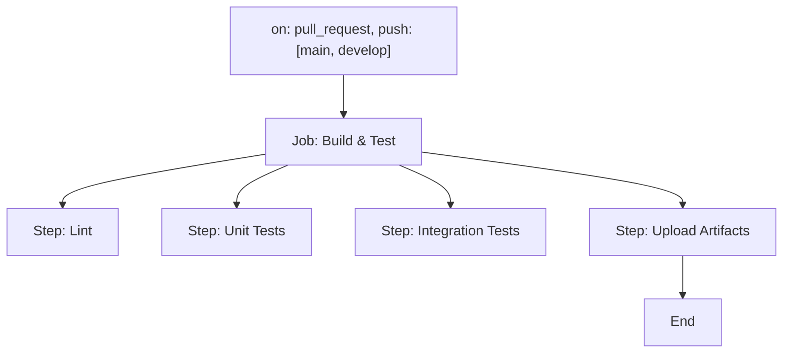
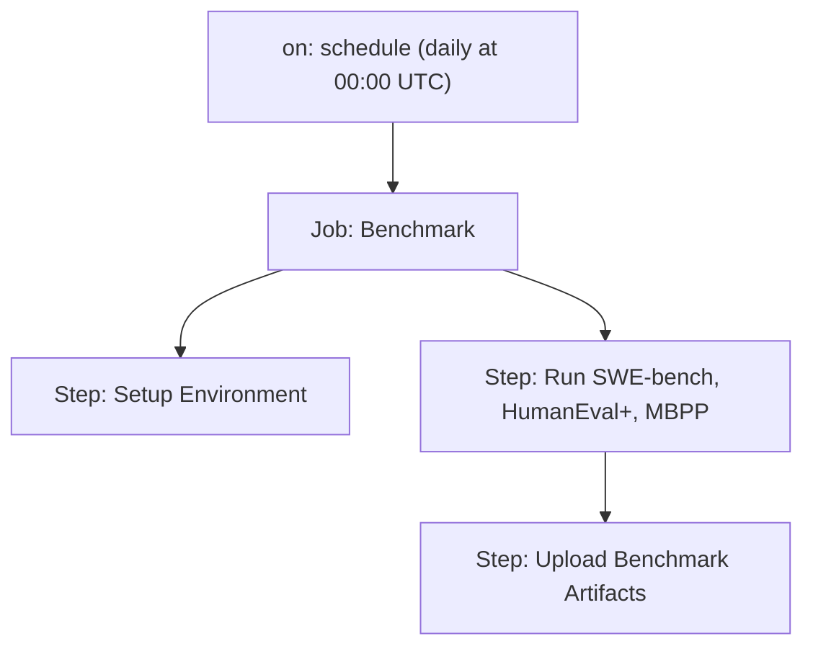
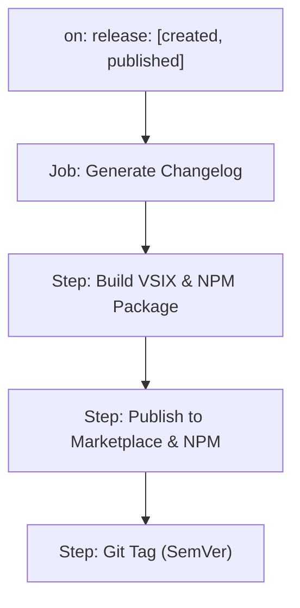
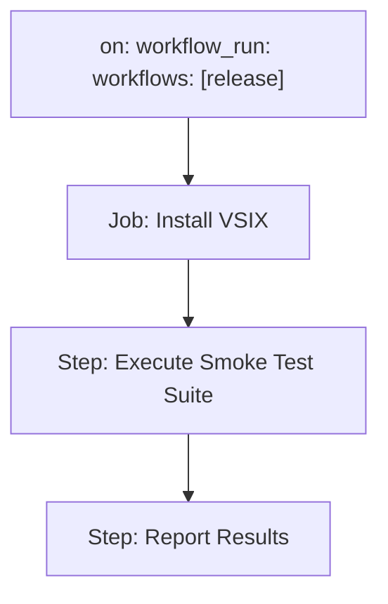

# CI/CD & Deployment

> **Accessibility:** All diagrams and images include descriptive alt text. For feedback or accessibility requests, open an issue or email the maintainers. We strive for WCAG 2.1 AA compliance in all docs.

> **Note:** This file consolidates and supersedes the previous 'CI-CD & Deployment Pipeline Documentation.md'.

This document outlines Rocketship's CI/CD workflows, CLI companion runbook, and release management practices tailored for GitHub Actions and optional Jenkins integration.

---

## 1. Pipeline Diagrams

### 1.1 CI Pipeline (`ci.yml`)


- **Triggers:** `pull_request` and `push` on `main`/`develop` branches.
- **Environment:** `ubuntu-latest`, `macos-latest`, `windows-latest` runners.
- **Artifacts:** Test reports and coverage data via `actions/upload-artifact`.

### 1.2 Benchmark Pipeline (`bench.yml`)

- **Triggers:** Scheduled daily at midnight UTC via `schedule`.
- **Environment:** `ubuntu-latest` with optional GPU support.
- **Artifacts:** Benchmark scores and diff reports for regression tracking.

### 1.3 Release Pipeline (`release.yml`)

- **Triggers:** GitHub `release` events when a new release is created.
- **Artifacts:** VSIX package, NPM artifacts, and autogenerated release notes.

### 1.4 Smoke Tests Pipeline (`smoke-tests.yml`)

- **Triggers:** `workflow_run` on completion of the `release` workflow.
- **Tests:** Basic health checks and command invocation validation.
- **Reports:** Pass/fail status published as build artifacts.

---

## 2. CLI Companion Runbook

The `@rocketship/cli` package provides headless CI commands:

```bash
npx rocketship --ci plan      # Generate JSON plan from specs
npx rocketship --ci code      # Output code stubs to stdout or filesystem
npx rocketship --ci test      # Run tests and output results
npx rocketship export-data    # Export session & memory data
```

### 2.1 Environment Prerequisites
- **Node.js** v16+ via `actions/setup-node`.
- **Xvfb** for headless webview tests on Linux; install via:
  ```bash
  sudo apt-get update && sudo apt-get install -y xvfb
  xvfb-run -a npm run smoke-tests
  ```
- **GITHUB_TOKEN** secret for authenticating CI operations.

---

## 3. Release Management Guide

### 3.1 Semantic Versioning (SemVer)
- **Policy:** Follow [SemVer 2.0.0](https://semver.org/) (MAJOR.MINOR.PATCH).
- **Automation:** Use `semantic-release` to infer versions from commit messages and update `package.json`.

### 3.2 CHANGELOG.md Conventions
- **Format:** Adhere to [Keep a Changelog](https://keepachangelog.com/) guidelines:
  ```markdown
  ## [1.2.3] - 2025-05-15
  ### Added
  - New feature X
  ### Fixed
  - Bug Y
  ```
- **Generation:** Automate changelog creation via `auto-changelog` or GitHub Actions.

### 3.3 Dependabot Grouping Rules
Include `.github/dependabot.yml` with grouping:
```yaml
version: 2
updates:
  - package-ecosystem: "npm"
    directory: "/"
    schedule:
      interval: "weekly"
    groups:
      core-deps:
        patterns: ["lodash*", "react*"]
      dev-deps:
        dependency-type: "development"
```
- **Grouping:** Combine related dependency updates into single pull requests.
- **Security Updates:** Use `applies-to: "security-updates"` to group vulnerability patches.

## See also
- architecture.md
- onboarding.md
- security.md

---

## Badge & Artifact Conventions

Rocketship uses status badges in the README to communicate project health and CI/CD status:

| Badge         | Location      | Meaning                                      |
|---------------|--------------|----------------------------------------------|
| Build Status  | README.md     | Latest CI build status (main branch)         |
| Coverage      | README.md     | Test coverage percentage (main branch)       |
| Release       | README.md     | Latest published release/version             |

**Example Markdown Badges:**
```md


```

- Badges are updated automatically by CI workflows.
- Artifacts (coverage reports, release assets) are retained for 90 days by default.
- See [README.md](../README.md) for live badges and [glossary.md](glossary.md) for definitions.

---

## SLSA & SBOM Automation

- CI/CD workflows generate provenance metadata for each build and release, following SLSA guidelines.
- SBOMs are generated using [Syft](https://github.com/anchore/syft) and published as release artifacts.
- See [security.md](security.md) for details on SLSA compliance and SBOM generation.
- For definitions, see [glossary.md](glossary.md).

> **Note:** Static SVG diagrams are available in `docs/assets/` for offline or preview use.
