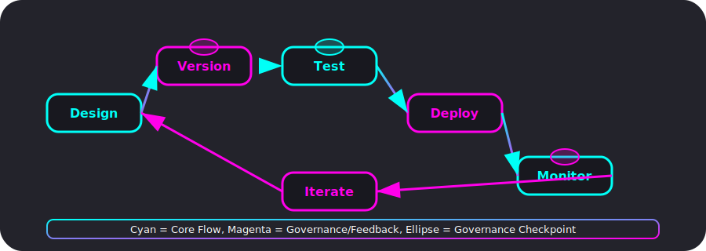

# Prompt Engineering

> **Note:** This file consolidates and supersedes the previous 'Prompt Engineering Guidelines.md'.

---


*Figure: The prompt engineering lifecycle in Rocketship, showing design, versioning, testing, deployment, monitoring, and iterative improvement, with agent/system prompt flows and governance checkpoints. All diagrams are accessible and follow Rocketship's visual standards.*


*Figure: Mermaid diagram of the prompt engineering workflow, including governance and feedback loops. Alt: Flow from design to versioning, testing, deployment, monitoring, and iteration.*

---

Effective prompt engineering hinges on clarity, context, and iterative refinement. Core principles—such as specificity, role definition, and structured prompting—lay the foundation for reliable model behavior. Advanced techniques like chain-of-thought, few-shot prompting, and reflexive self-evaluation boost reasoning and resilience to hallucinations. Responsible practices, including bias mitigation, prompt safety, and modular template management, ensure ethical and maintainable workflows. Rigorous testing, A/B experimentation, and metrics-driven optimization complete a disciplined prompt engineering lifecycle that maximizes performance across use cases.

## 1. Core Principles

### 1.1 Clarity & Specificity
Prompts must articulate the exact task, expectations, and constraints to prevent ambiguous or generic outputs.

### 1.2 Context & Scope
Provide sufficient background or data snippets to enable domain-relevant responses, while bounding context size to avoid token overflow.

### 1.3 Role & Persona
Assign a clear role (e.g., "You are a senior data engineer.") and desired tone to align outputs with stylistic and expertise requirements.

## 2. Advanced Techniques

### 2.1 Chain-of-Thought Prompting
Encourage models to "think step-by-step" to improve multi-step reasoning, reducing hallucinations and logical errors.

### 2.2 Few-Shot & Zero-Shot Prompting
Demonstrate desired output formats through a small number of examples (few-shot), or rely on explicit instructions for zero-shot, depending on the task complexity.

### 2.3 Reflexive Self-Evaluation (Reflexion)
Implement multi-pass prompts where the model critiques its own output and iteratively refines the response for higher accuracy.

### 2.4 Multi-Objective Directional Prompting (MODP)
Incorporate metrics-driven "directional" cues to guide the model towards multiple objectives simultaneously, balancing correctness and style.

### 2.5 Sequential Optimal Prompt Learning
Use Bayesian or Knowledge-Gradient frameworks to automatically optimize prompt parameters through sequential trials under a limited evaluation budget.

## 3. Responsible Prompting

### 3.1 Bias & Fairness Mitigation
Use balanced examples and avoid loaded language; employ fairness-aware evaluators to detect biased outputs.

### 3.2 Prompt Safety & Injection Guardrails
Sanitize inputs, lock system messages, and apply semantic filters to thwart injection attempts and ensure stable behavior.

## 4. Testing & Iteration

### 4.1 Prompt Versioning & A/B Testing
Maintain a versioned registry of prompt variants; measure performance metrics (accuracy, cost, user overrides) to select optimal versions.

### 4.2 Metrics-Driven Optimization
Track key indicators—task success rate, token usage, latency—and automate threshold-based alerts for prompt regressions.

## 5. Template Library

| Use Case            | Template Snippet                                     |
|---------------------|-------------------------------------------------------|
| QA                  | "Answer the following question based on context: {{context}} Q: {{query}} A:" |
| Summarization       | "Summarize the text below in {{length}} words: {{text}}" |
| Code Generation     | "Write a {{language}} function that {{spec}}. Provide only code, no explanations." |
| Test Generation     | "Based on the function signature and implementation, generate Jest tests." |

## 6. Tooling & Workflow

### 6.1 Prompt Management Platforms
Leverage platforms like PromptHub or promptingguide.ai for collaborative prompt versioning and performance tracking.

### 6.2 Retrieval-Augmented Prompting
Combine RAG context (graph snippets + vector chunks) with structured prompts to enrich domain knowledge without exceeding token limits.

### 6.3 LoRA Adapter Injection
For repetitive or domain-specific tasks, inject low-rank adapters to fine-tune base models on-the-fly, then reflect the adapter ID in prompts for contextual awareness.

## 7. Maintenance & Collaboration

> **TODO:** Ensure all agent/system prompts are covered by versioned `.tpl` files with version/timestamp headers in `extension/src/prompts/`. Track prompt load telemetry as implemented or as a TODO in the codebase.

### 7.1 Prompt ADRs
Document major prompt-design decisions as ADRs (e.g., adopting MODP) to trace rationale and facilitate future audits.

### 7.2 Sharing & Reuse
Store shared prompt templates and best practices in a centralized "prompts" repository, with clear naming, metadata, and usage examples.

## See also
- agents.md
- architecture.md
- onboarding.md

## 8. Development Prompt Library

> **For implementation and integration guidance, see also:**
> - [Feature_Enhancements.md](../Feature_Enhancements.md)
> - [architecture.md](architecture.md)

This section collects actionable, staged prompts and code snippets for LLM agents and developers, distilled from the integration and implementation strategy. Use these as scaffolding or reference for automating best-practice workflows.

### Stage 1: Verify Monorepo Integrity & ESM Build
```
Prompt: Verify all source files are tracked, clean build outputs, run composite build, and ensure ESM compliance in all packages. Correct tsconfig.json as needed for nodenext and ESM.
```

### Stage 2: Scaffold & Publish Shared and Core Packages
```
Prompt: Scaffold package.json and tsconfig.json for @rocketship/core and @rocketship/shared. Ensure correct exports, paths, and build steps. Build both packages and update root tsconfig.base.json paths.
```

### Stage 3: Inject Circuit-Breaker & Retry
```
Prompt: Install opossum, create CircuitBreakerFactory, and wrap agent execution in circuit breakers. Standardize error handling with RocketshipError interface.
```

### Stage 4: Enforce JSON-Schema Validation
```
Prompt: Install ajv, create and use JSON schemas for agent outputs, and validate outputs in each agent's execute method.
```

### Stage 5: Hybrid Retrieval & Vector Store
```
Prompt: Install @lancedb/sdk, implement HybridRetrievalService, connect to LanceDB, and enable semantic search and chunk deduplication.
```

### Stage 6: Sandboxed Inference with Testcontainers
```
Prompt: Install testcontainers, create TestSandbox helper, and run inference in isolated containers for safety and reproducibility.
```

> For more detailed, step-by-step prompts and code, see the project's integration plan and architecture documentation.