# 🚀 Rocketship Project Roadmap

> **For the canonical implementation plan and actionable tasks, see also:**
> - [Feature_Enhancements.md](../Feature_Enhancements.md)
> - [TODO.md](../TODO.md)

This roadmap is the single source of truth for all completed, in-progress, and outstanding work. Tasks are grouped by phase, area, and priority, with dependencies, estimated effort, and quality gates. Update this file after every major batch of changes.

---

## Roadmap Phases Overview

*Figure: High-level project phases and workflow. See below for Mermaid source and details.*

```mermaid
flowchart LR
  A[Phase 1: Stabilisation & Structure] --> B[Phase 2: Test & Schema Integration]
  B --> C[Phase 3: Prompt Governance & RAG]
  C --> D[Phase 4: CI/CD, Observability, Security]
  D --> E[Phase 5: Advanced Services & Plugin Extensibility]
  E --> F[Phase 6: Ongoing Maintenance & Review]
  style A fill:#23232b,stroke:#00fff7,stroke-width:3
  style B fill:#23232b,stroke:#ff00ea,stroke-width:3
  style C fill:#23232b,stroke:#00fff7,stroke-width:3
  style D fill:#23232b,stroke:#ff00ea,stroke-width:3
  style E fill:#23232b,stroke:#00fff7,stroke-width:3
  style F fill:#23232b,stroke:#ff00ea,stroke-width:3
```

Mermaid Diagram (for quick edits)

---

## Milestone Summary Table

| Phase | Milestone/Deliverable                        | Est. Effort | Quality Gates                |
|-------|----------------------------------------------|-------------|------------------------------|
| 1     | Codebase Stabilisation & Structure           | 2–3 days    | Lint, ESM, DRY, docs review  |
| 2     | Test & Schema Integration                   | 3–4 days    | ≥80% coverage, schema val.   |
| 3     | Prompt Governance & RAG Foundation           | 2–3 days    | Prompt lint, RAG telemetry   |
| 4     | CI/CD, Observability, Security               | 1 week      | CI green, SAST, dashboards   |
| 5     | Advanced Services & Plugin Extensibility     | 1 week+     | Plugin tests, doc coverage   |
| 6     | Ongoing Maintenance & Review                 | Ongoing     | Recurring reviews, docs sync |

---

## Phase 1: Codebase Stabilisation & Structure

**Tasks:**
- [x] Adopt Nx, pnpm, Vitest; remove legacy tools
- [x] Standardize ESM build, TypeScript config, and workspace structure
- [x] Scaffold all core and advanced agents/services with canonical interfaces and TODOs
- [x] Update all major docs to reflect current stack and structure
- [x] Confirm all shared types, helpers, and schemas are centralized and DRY
- [x] Add/expand API docs for all services (Orchestrator, Retrieval, etc.)
- [x] Lint, DRY, and ESM compliance; docs review

**Estimated Effort:** 2–3 days

**Note:** All foundational scaffolding (prompts, schemas, tests, helpers) is now in place. The project is ready for implementation and refinement.

---

## Phase 2: Test & Schema Integration

**Tasks:**
- [x] Scaffold minimal unit and contract test files for each agent/service
- [x] Refactor contract tests to use dynamic ports
- [x] Implement real agent calls in contract tests
- [x] Ensure integration tests skip gracefully if Docker/Testcontainers is unavailable
- [x] Scaffold or update JSON schema files for each agent's output
- [x] Integrate schema validation in each agent's `execute` method (Ajv)
- [x] Emit telemetry for validation success/failure
- [x] Expand `docs/testing.md` with test strategies, troubleshooting, and coverage reporting
- [x] Achieve ≥80% test coverage, schema validation, contract test pass

**Estimated Effort:** 3–4 days

---

## Phase 3: Prompt Governance & RAG Foundation

**Tasks:**
- [x] Scaffold minimal `.tpl` prompt templates for all agents (with version/timestamp headers and TODOs)
- [x] Lint prompt templates in CI (`.github/workflows/prompt-lint.yml`)
- [x] Emit telemetry on prompt load/version
- [x] Scaffold/implement token-based chunking and real embedding model in RAG pipeline
- [x] Emit telemetry for RAG ingestion, retrieval, deduplication
- [x] Expand `docs/prompts.md` and RAG sections in `docs/architecture.md`
- [x] Ensure prompt lint, RAG telemetry, prompt versioning

**Estimated Effort:** 2–3 days

---

## Phase 4: CI/CD, Observability, Security

**Tasks:**
- [ ] Ensure all CI workflows (lint, test, prompt-lint, build) are green and block on failure
- [ ] Integrate code coverage reporting and enforce thresholds
- [ ] Populate `observability/dashboards/` with per-agent Grafana JSON and alert rules
- [ ] Expose Prometheus `/metrics` endpoint
- [ ] Instrument all core services and agents with OpenTelemetry
- [ ] Build minimal dashboard (VS Code webview or web UI) for real-time monitoring
- [ ] Add/expand `docs/observability.md` and `docs/ci-cd.md`
- [ ] Add/expand `docs/security.md` for secret management, input validation, and compliance
- [ ] CI green, SAST/DAST pass, dashboards live

**Estimated Effort:** 1 week

---

## Phase 4.5: Disaster Recovery Drills & Automated Failover Tests

**Tasks:**
- [ ] Automate regular backups for LanceDB (vector DB) and audit logs
- [ ] Scaffold and schedule restore/failover drills for LanceDB and audit logs
- [ ] Implement health check scripts for vector DB and audit log integrity
- [ ] Add CI workflow (`.github/workflows/dr-drill.yml`) to run DR drills on schedule
- [ ] Emit telemetry and alert on drill failures
- [ ] Document DR procedures and runbooks in `docs/disaster-recovery.md`
- [ ] Integrate DR status into observability dashboards

**Estimated Effort:** 1–2 days

**See also:** [docs/disaster-recovery.md](disaster-recovery.md), [scripts/drill-lancedb.sh](../scripts/drill-lancedb.sh), [scripts/drill-auditlog.sh](../scripts/drill-auditlog.sh)

---

## Phase 4.6: Resilience, Self-Healing, and Continuous Learning

**Tasks:**
- [ ] Scaffold and implement SupervisorService (singleton, global fallback, snapshot/rollback, config-driven)
- [ ] Integrate crash reporting (AIER agent, error_reports table, human-reviewed fix scripts)
- [ ] Add agent-level defensive middleware/interceptors, with per-agent config in rocketship.yaml
- [ ] Register DuckDuckGo tool (global, agent-scoped, Redis cache, rate limits, fallback providers)
- [ ] Scaffold TrainerAgent (nightly/manual, curated sources, vector store namespace)
- [ ] Implement ReflexionAgent prompt update proposal and lessons storage in LanceDB
- [ ] Add config stubs for caching, rate-limits, and search providers (global + per-tool)
- [ ] Instrument all resilience/self-healing events with OpenTelemetry and expose in dashboards
- [ ] Create and maintain docs/resilience.md for all resilience/self-healing patterns

**Estimated Effort:** 2–3 days

**See also:** [docs/resilience.md](resilience.md), [rocketship.yaml](../rocketship.yaml), [extension/src/services/SupervisorService.ts](../extension/src/services/SupervisorService.ts), [extension/src/agents/TrainerAgent.ts](../extension/src/agents/TrainerAgent.ts), [extension/src/tools/duck-duckgo-tool.ts](../extension/src/tools/duck-duckgo-tool.ts)

---

## Phase 5: Advanced Services & Plugin Extensibility

**Tasks:**
- [ ] Scaffold and implement ModelAdvisor, BanditController, PKGService, LoRAAdapterService
- [ ] Refactor OrchestratorService to graph/state-machine model; define agent roles (Planner, Critic, Executor, ReflectionAgent)
- [ ] Implement message-passing and task queueing natively
- [ ] Integrate lightweight, embeddable knowledge graph (TypeScript-native or adapter)
- [ ] Refactor ToolRegistry for runtime registration, discovery, and removal; integrate Opossum
- [ ] Add CriticAgent, ReflectionAgent, and feedback logging
- [ ] Require agent outputs to include rationale and decision trace
- [ ] Log all actions, tool invocations, and errors to central audit log
- [ ] Implement HITL checkpoints as middleware
- [ ] Document and test plugin lifecycle and extension points
- [ ] Add advanced agent/service extension points for v2+
- [ ] Expand `docs/plugins.md` with lifecycle, DI, and security
- [ ] Plugin tests, doc coverage, extension point validation

**Estimated Effort:** 1 week+

---

## Phase 6: Ongoing Maintenance & Review

**Tasks:**
- [ ] Regularly review and update all documentation and TODOs
- [ ] Track all TODOs in a central place (e.g., GitHub Issues or `TODO.md`)
- [ ] Encourage contributors to update docs as part of every PR
- [ ] Schedule periodic recursive reviews of all documentation
- [ ] Onboard new contributors with up-to-date guides and roadmap references
- [ ] Maintain and update the Integration & Technical Plan as new research emerges
- [ ] Recurring reviews, docs sync, onboarding feedback

**Estimated Effort:** Ongoing

---

## Rationale

This phased roadmap is designed to:
- **Stabilize the codebase and enforce best practices** before layering on complexity.
- **Integrate testing and schema validation early** to catch regressions and enforce contracts.
- **Establish prompt governance and RAG foundation** for robust, adaptive agent workflows.
- **Prioritize CI/CD, observability, and security** to ensure reliability and compliance from the start.
- **Enable extensibility and advanced features** only after the core is stable and observable.
- **Maintain a living process** of review, documentation, and onboarding to support sustainable growth.

**Sequence reasoning:**
- Codebase stabilization and documentation are prerequisites for all further work.
- Testing and schema validation must precede prompt and RAG enhancements to ensure correctness.
- Prompt governance and RAG are core to agent quality and must be in place before scaling up.
- CI/CD, observability, and security are critical for production readiness and must be enforced before extensibility.
- Advanced services and plugin support are last, as they depend on a stable, observable, and secure foundation.

---

## See also
- architecture.md
- configuration.md
- onboarding.md
- testing.md
- prompts.md
- agents.md
- plugins.md
- observability.md
- ci-cd.md
- security.md

## Integration & Technical Plan (2024)

This section summarizes the latest integration and technical plan, synthesizing best practices and research for Rocketship. For full details, see the 'Integration & Technical Plan' in [Feature_Enhancements.md](../Feature_Enhancements.md).

**Key Enhancements:**
- Graph-based, multi-agent orchestration (Plan→Dispatch→Resolve)
- Unified MemoryService (vector + knowledge graph)
- Dynamic ToolRegistry with circuit breaking and runtime registration
- CriticAgent, ReflectionAgent, and feedback loops
- Explainability, audit logging, and human-in-the-loop (HITL) checkpoints
- OpenTelemetry-based observability and dashboards
- Prompt metadata, evaluation, and governance
- Strict modularity, performance, and extension points

**Implementation Phases:**
1. Orchestration & Memory Foundation
2. Agentic Enhancements
3. Observability, Security, and Governance
4. UI & Extensibility

Each phase below has been updated to reflect these priorities.