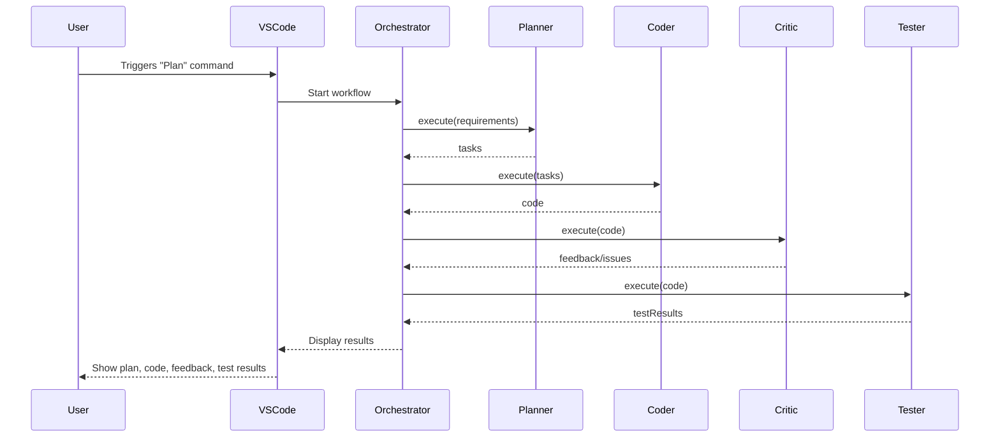
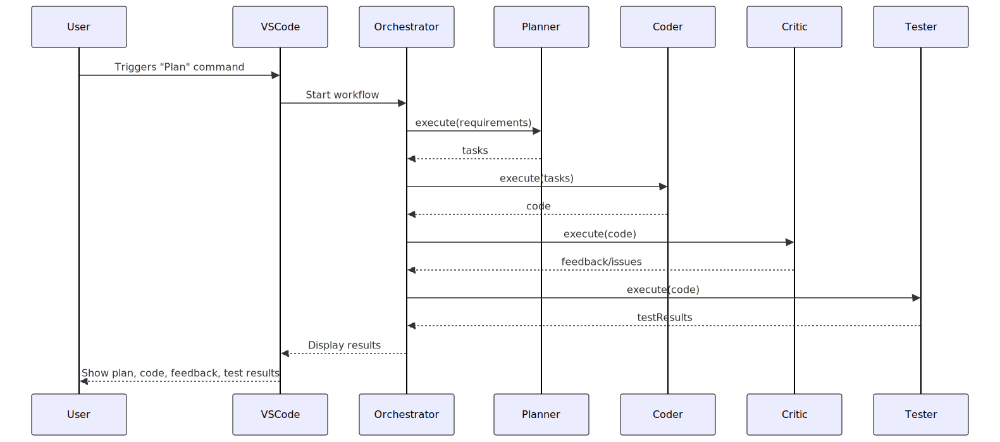
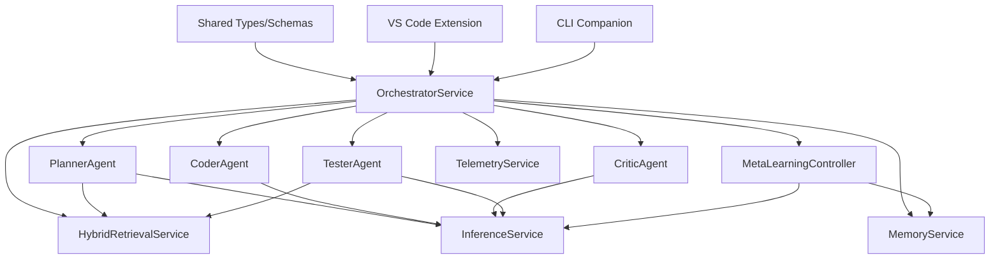

# Project Roadmap

> **Accessibility:** All diagrams and images include descriptive alt text. For feedback or accessibility requests, open an issue or email the maintainers. We strive for WCAG 2.1 AA compliance in all docs.

> **Note:** This file consolidates and supersedes the previous 'Project_Roadmap.md'.

> **Terminology Note:** For definitions of agents, services, and plugins, see the [Rocketship Glossary](glossary.md).

## Vision & Objectives

> **Vision:** Enable seamless, end-to-end software development automation within VS Code by leveraging multi-agent orchestration, hybrid retrieval (vector + knowledge graph), on-the-fly fine-tuning, and persistent memory for self-improving productivity.

> **Objectives:**
>
> 1. Automate Plan → Code → Test workflows with minimal user intervention.
> 2. Architect a plugin-first, extensible model for advanced capabilities.
> 3. Optimize for constrained hardware (e.g., M1 MacBook Pro).
> 4. Enforce security, sandboxing, and auditability for compliance.

## Project Execution Guidance

Based on our alignment and sprint planning, please note the following execution assumptions and guidelines:

1. **Solo Development with LLM Assistance**
   This project will be driven by a solo developer augmented by multiple LLM coding assistants. Roles such as SRE, security, and compliance will be addressed within sprint planning as needed, leveraging best practices and standard protocols.

2. **Continuous Improvement and Gap Recommendations**
   Opportunities for improvements or gaps should be flagged at any stage. The roadmap remains flexible to incorporate enhancements or refinements without strict persona constraints, prioritizing a major release followed by incremental updates.

3. **Development Baseline and Performance Thresholds**
   Development is targeting an M1 MacBook Pro with 16GB RAM. First-use latency benchmarks should remain under 4 seconds for Plan → UI load. Performance metrics will be validated on this baseline.

4. **Security, Compliance, and SOC 2 Planning**
   Security and SOC 2 compliance tasks should be baked into sprint planning. Adopt European data protection standards (e.g., GDPR) for telemetry, memory, and audit-log handling.

5. **CI/CD Platforms and Target Environments**
   Primary CI pipelines will run on GitHub Actions and Jenkins. We will support self-hosted Linux and macOS initially, with Windows support scheduled for a subsequent phase.

6. **Pilot Ownership and Triage**
   The development team (the solo developer and the LLM assistants) will serve as the initial pilot group. Use discretionary triage to prioritise features and bugfixes based on ongoing feedback.

7. **UX & Usability as Core Principles**
   UX, user-friendliness, and actionable intelligence are non-negotiable pillars. Incorporate guided tours, in-IDE diagnostics, and clear documentation as part of each major feature.

8. **Release Strategy**
   We will aim for a major v1 release upon MVP completion, followed by unscheduled minor and patch releases to rapidly address feedback and improvements.

---

## Project Plan

(See full roadmap for detailed milestones and timelines.)

---

## Quality Gates & CI Checks

Rocketship's CI pipeline enforces:
- **Dead Code Detection:** `ts-prune` flags unused exports in TypeScript.
- **Circular Dependency Detection:** `madge` finds import cycles.
- **Blocking Policy:** Both checks run on every push/PR and block merges on failure.

See [architecture.md](architecture.md#quality-gates) for workflow diagrams and details.

---

## Appendices: Visuals, Examples, and Glossary

### Appendix A: Diagrams & Visuals

#### A1: Plan → Code → Critique → Test Sequence




#### A2: System Dependency Flow




### Appendix B: Prompt Example Templates

#### B1: PlannerAgent Prompt Template

```handlebars
{{!--@promptVersion:{{gitSHA}}--}}
You are a software planner agent. Given the following requirements, return a structured task list using the schema below.

## Requirements
{{requirements}}

## Output Schema
{
  "tasks": [
    { "id": string, "description": string, "priority": "high" | "medium" | "low" }
  ]
}
```

#### B2: CoderAgent Prompt Template

```handlebars
{{!--@promptVersion:{{gitSHA}}--}}
You are a code generation agent. Use the task input and project metadata to generate functionally complete code blocks.

## Task
{{task}}

## Code Context
{{retrievedContext}}

## Output Format
```ts
// Filename: {{filename}}
{{generatedCode}}
```
```

### Appendix C: Glossary

| Term                       | Definition                                                                 |
|----------------------------|----------------------------------------------------------------------------|
| **Agent**                  | A specialised LLM-driven function (e.g., Planner, Coder, Tester).          |
| **OrchestratorService**    | Core controller for agent workflows. Coordinates execution and DI.        |
| **Hybrid Retrieval**       | Combines vector embeddings + PKG-based graph search for rich context.     |
| **LoRA Adapter**           | Lightweight fine-tuning layer for domain adaptation of LLMs.              |
| **Reflexion**              | A meta-cognitive self-review loop to improve outputs via learning.        |
| **Ajv**                    | A fast JSON Schema validator used to validate inputs/outputs.             |
| **Circuit Breaker**        | A resilience pattern to stop repeated failures (via Opossum).             |
| **Prompt Governance**      | Version control, safety enforcement, and auditing of prompt templates.    |
| **RAG**                    | Retrieval-Augmented Generation—injecting context into model prompts.      |
| **TelemetryService**       | Captures usage and performance metrics for monitoring and optimisation.   |
| **PKG (Programming KG)**   | A knowledge graph built from code structure: functions, imports, classes. |

### Appendix D: Sample `rocketship.yaml` Configuration

```yaml
version: 1
agents:
  planner:
    enabled: true
    promptTemplate: planner-agent.tpl
    outputSchema: planner-agent.schema.json

  coder:
    enabled: true
    promptTemplate: coder-agent.tpl
    outputSchema: coder-agent.schema.json

retrieval:
  method: hybrid
  vectorStore: lance
  chunkSize: 300
  deduplication: true

model:
  backend: local
  quantization: q4_0
  router:
    strategy: adaptive
    fallback: mistral-7b-instruct

telemetry:
  enabled: true
  endpoint: http://localhost:9464/metrics
```

## User Personas & Stories

| Persona           | User Story                                                                                  | Roadmap Milestone(s)         |
|-------------------|--------------------------------------------------------------------------------------------|------------------------------|
| Novice Developer  | Generate unit-test templates for functions to quickly validate edge cases.                 | Stage 2, Milestone 2.1, 2.3  |
| AI-Power User     | Fine-tune the base model with code style via LoRA adapters for team convention alignment.   | Stage 5, Milestone 5.2, 5.4  |
| DevOps Engineer   | Use headless CLI in CI to automate plan/code/test validation on PRs.                       | Stage 4, Milestone 4.2, 4.3  |

---

## Use-Case Catalog Mapping

| ID  | Title                        | Roadmap Stage(s) / Milestone(s)         | MVP?   |
|-----|------------------------------|-----------------------------------------|--------|
| UC1 | Requirement Analysis         | Stage 2.1, 2.3                          | Yes    |
| UC2 | Contextual Code Generation   | Stage 2.1, 2.3, 5.4                     | Yes    |
| UC3 | Automated Testing            | Stage 2.1, 2.3, 4.1                     | Yes    |
| UC4 | On-the-Fly Fine-Tuning       | Stage 5.2, 5.4                          | v2+    |
| UC5 | Adaptive Model Selection     | Stage 5.2                               | v2+    |
| UC6 | Long-Term Session Memory     | Stage 5.3                               | v2+    |
| UC7 | Self-Reflection & Meta-Opt.  | Stage 5.3                               | v2+    |

---

## Scope Boundaries

- **In-Scope (v1 MVP):** UC1, UC2, UC3; core services, vector-only retrieval, session memory, Planner/Coder/Tester Agents, VS Code UI, CLI.
- **Out-of-Scope (v1 MVP):** UC4–UC7; advanced PKG, LoRA, Bandits, persistent memory, Reflexion, plugin registry, SOC 2 compliance.
- **v2+ Additions:** UC4–UC7, PKG schema, SOC 2 audit-log storage, telemetry dashboards.

---

## Global Acceptance Criteria

- **Functional:** Each use case must have automated tests covering end-to-end flows with ≥80% code coverage.
- **Performance:** Activation to first Plan panel load <2s on M1 Mac; code generation latency <3s per 512-token request.
- **Security:** No CLI command or extension activation should expose secrets in logs; models must be checksum-verified pre-load.

---

## Rocketship Project Roadmap

(See full roadmap for detailed milestones and timelines.)

## See also
- architecture.md
- configuration.md
- onboarding.md

> **Note:** Static SVG diagrams are available in `docs/assets/` for offline or preview use.