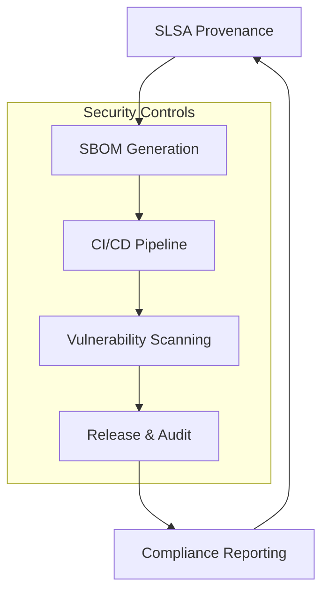

# Security & Compliance

This document consolidates security, compliance, SAST/DAST, and privacy for Rocketship.

---


*Figure: Rocketship's security and compliance flows, showing SLSA, SBOM generation, CI/CD integration, vulnerability scanning, and release management. All diagrams are accessible and follow Rocketship's visual standards.*


*Figure: Mermaid diagram of Rocketship's security workflow, including security controls and compliance reporting. Alt: Flow from SLSA to SBOM, CI/CD, scanning, release, and compliance.*

---

## See also
- architecture.md
- testing.md
- onboarding.md

# Supply Chain Security: SLSA & SBOM

## SLSA (Supply-chain Levels for Software Artifacts)

SLSA is a security framework for ensuring the integrity of software supply chains. Rocketship aims to achieve SLSA compliance by:
- Using reproducible builds and signed release artifacts
- Enforcing CI/CD provenance and artifact retention
- Automating dependency updates and vulnerability scanning
- Publishing provenance metadata with each release

For more, see [slsa.dev](https://slsa.dev/) and the [glossary](glossary.md).

## SBOM (Software Bill of Materials)

Rocketship generates and publishes SBOMs for each release to document all dependencies and their versions.

**How to generate an SBOM:**
- Install [Syft](https://github.com/anchore/syft):
  ```sh
  curl -sSfL https://raw.githubusercontent.com/anchore/syft/main/install.sh | sh -s -- -b /usr/local/bin
  syft . -o cyclonedx-json > sbom.json
  ```
- SBOMs are published as CI artifacts and attached to each release.
- CI/CD workflows run SBOM generation and upload steps automatically (see [ci-cd.md](ci-cd.md)).

**Why SBOMs matter:**
- Enable rapid vulnerability response
- Improve transparency for users and auditors
- Satisfy compliance requirements (e.g., SOC 2, SLSA)

See also: [ci-cd.md](ci-cd.md), [glossary.md](glossary.md)